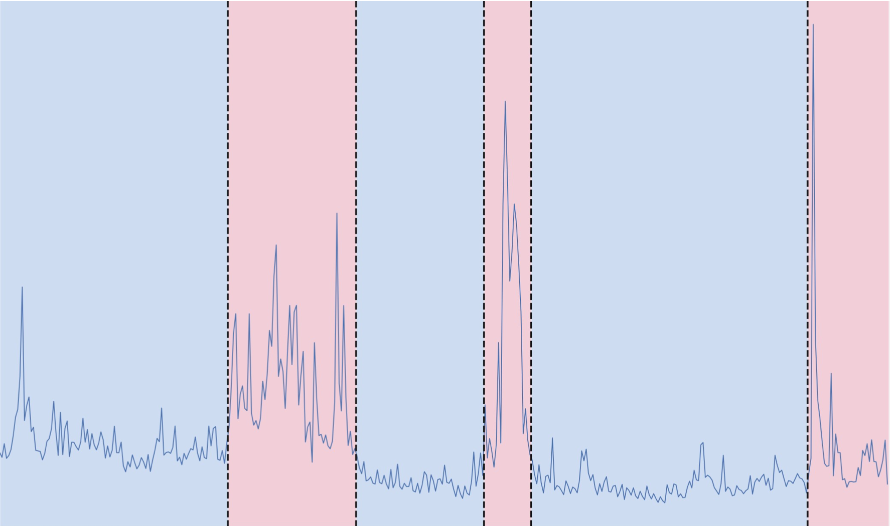
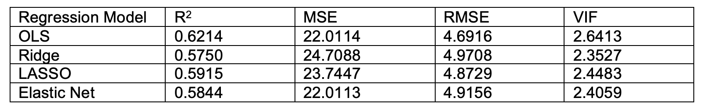

# Stock-Market-Volatility-Analysis

## Overview

This project analyzes the factors driving stock market volatility using the VIX (Volatility Index) as the response variable and 45 Equity Market Volatility (EMV) trackers as predictors. The objective is to identify key forces influencing market volatility and evaluate the predictive performance of several regression-based machine learning models.

The analysis compares Ordinary Least Squares (OLS), Ridge Regression, LASSO Regression, and Elastic Net Regression using multiple model evaluation metrics. A second phase investigates how the drivers of volatility change across different market periods, including major events such as the 2008 Financial Crisis and the COVID-19 pandemic.



*Historical VIX levels from 1990–2022 highlighting periods of elevated market volatility.*

---

## Research Questions

### Phase 1
- Can we identify mechanisms underlying sudden changes in stock market volatility?
- Is it possible to forecast the VIX using historical market uncertainty indicators?
- Are historical EMV measures sufficient for predicting future market volatility?

### Phase 2
- What forces drive stock market movements during different time periods?
- Do periods of high volatility exhibit different patterns of predictor importance than stable periods?
- Can segment-specific analysis provide a clearer understanding of volatility dynamics?

---

## Data

The dataset contains:

- Monthly VIX values (response variable)
- 45 monthly Equity Market Volatility (EMV) trackers
- Observations from January 1990 to December 2022

### Data Source

The original dataset is included in:

```
data/EMV_VIX_Data.xlsx
```

Variables include measures of:

- Political uncertainty
- Inflation
- Interest rates
- Trade
- Financial crises
- Labor markets
- Regulation
- Healthcare
- Energy and environmental policy
- And many other market uncertainty indicators

---

## Methods

### Models Evaluated

1. Ordinary Least Squares (OLS) Regression
2. Ridge Regression
3. LASSO Regression
4. Elastic Net Regression

### Model Evaluation Metrics

- R² (Coefficient of Determination)
- Mean Squared Error (MSE)
- Root Mean Squared Error (RMSE)
- Variance Inflation Factor (VIF)

### Cross-Validation

- 10-Fold Cross Validation (Phase 1)
- Leave-One-Out Cross Validation (LOOCV) for segmented analyses (Phase 2)

---

## Key Findings

### Model Comparison

All four models achieved similar predictive performance.

Key observations:

- OLS achieved the highest R² but showed the strongest multicollinearity.
- Ridge reduced multicollinearity through coefficient shrinkage.
- LASSO produced a sparse model through automatic variable selection.
- Elastic Net balanced the advantages of Ridge and LASSO and was selected as the final model.

The figure below compares the performance of OLS, Ridge, LASSO, and Elastic Net regression models using R², RMSE, MSE, and VIF metrics.



### Volatility Drivers by Market Regime

The analysis identified different dominant factors across six market segments.

Examples include:

- **2008 Financial Crisis**
  - Labor Markets
  - Government Spending, Deficits, and Debt
  - Financial Crises

- **COVID-19 Pandemic**
  - Infectious Disease
  - Food and Drug Policy
  - Labor Regulations

These results demonstrate how market volatility is influenced by different economic, political, and social forces depending on prevailing conditions. :contentReference[oaicite:2]{index=2}

---

## Repository Structure

```
.
├── analysis/
│   ├── Stock_Market_Volatility_Analysis_Code.Rmd
│   └── Stock_Market_Volatility_Analysis_Code.pdf
│
├── data/
│   └── EMV_VIX_Data.xlsx
│
├── figures/
│   ├── ridgecv.png
│   ├── ridge.png
│   ├── lassocv.png
│   ├── lasso.png
│   ├── table.png
│   ├── phase1.png
│   ├── phase2.png
│   ├── phase2table.png
│   ├── figure.png
│   └── time.png
│
├── report/
│   ├── main.tex
│   └── Stock_Market_Volatility_Analysis.pdf
│
└── README.md
```

---

## Results

### Ridge Regression

- Cross-validation curve
- Coefficient path plot

### LASSO Regression

- Cross-validation curve
- Coefficient path plot

### Elastic Net Regression

- Final selected model
- Segment-specific volatility analysis
- Identification of dominant market forces across time periods

Figures can be found in the `figures/` directory.

---

## Reproducibility

1. Clone the repository.
2. Open `analysis/Stock_Market_Volatility_Analysis_Code.Rmd`.
3. Install required R packages:
   - tidyverse
   - ggplot2
   - readxl
   - caret
   - glmnet
   - e1071
4. Ensure `EMV_VIX_Data.xlsx` is located in the `data/` folder.
5. Knit the R Markdown file to reproduce all analyses, figures, model outputs, and results.

---

## Technologies

- R
- R Markdown
- glmnet
- caret
- ggplot2
- tidyverse
- LaTeX

---

## Author

**Nevena Ciganovic**  
M.Sc. Statistical Sciences, University of Toronto
